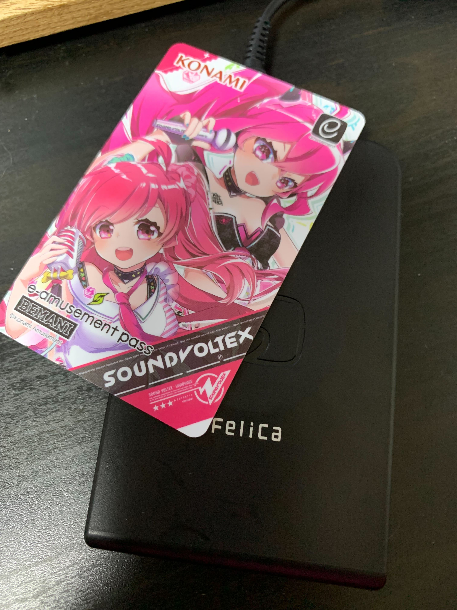

# What is libnfc-for-php?

This library is toy for me. You can read NFC with libnfc written in PHP.

# Requirements
- PHP 7.4 or later
- PHP FFI
- libnfc

# Supported

- PaSoRi RC-S330
  - https://www.amazon.co.jp/dp/B001MVPD8U/

# Warning

- PaSoRi RC-S380 is not supported the libnfc. I have a roadmap to implement RC-S380.
  - It is required to develop a driver. For example, the nfcpy has been implemented.
    - see: https://github.com/nfcpy/nfcpy/blob/master/src/nfc/clf/rcs380.py


# Quick start

## Mac
1. Install libnfc

```
$ brew install libnfc
```

2. Connect NFC Device into your machine.
3. Run example code

```
$ php examples/nfc-poll.php
```

4. Put your NFC



5. You can get output.


# License
- MIT
